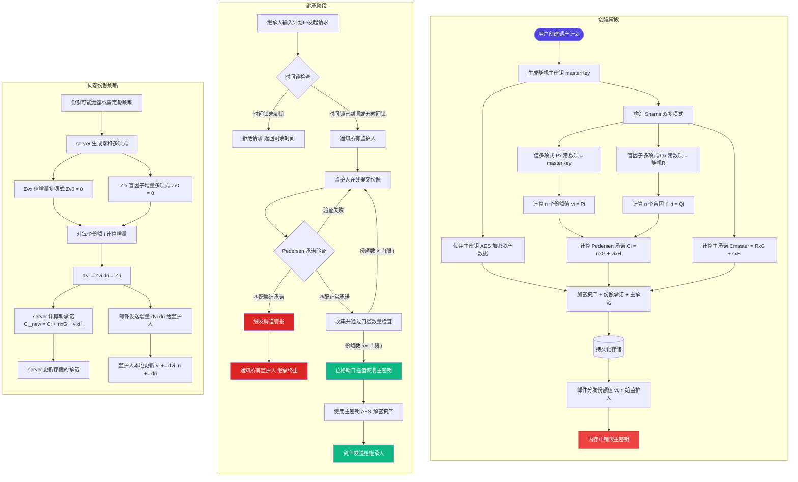

# 数字遗产管家（Digital Legacy Guardian）

## 基于门限密码与同态承诺的可验证数字资产继承协议

[](https://opensource.org/licenses/MIT)
[](https://nodejs.org/)
[](https://www.typescriptlang.org/)

---

## 📋 目录

- [项目概述](#项目概述)
- [核心功能](#核心功能)
- [密码学方法](#密码学方法)
- [快速开始](#快速开始)
- [项目结构](#项目结构)
- [技术栈](#技术栈)
- [应用场景](#应用场景)
- [核心优势](#核心优势)
- [AI助手](#ai助手)
- [文档](#文档)
- [贡献指南](#贡献指南)
- [许可证](#许可证)

---

## 项目概述

### 背景与挑战

数字化浪潮已深刻重塑个人资产的形态。从加密货币、数字钱包到云存储账号、社交平台、加密文件，**数字资产**在个人财富中的占比持续攀升。然而，这类资产存在一个根本性矛盾：

| 传统资产（房产、现金） | 数字资产（私钥、密码、加密文件） |
|-----------------------|-------------------------------|
| 可通过遗嘱明确继承 | **持有者死亡即永久丢失**——私钥无人知晓 |
| 受法律保护，争议有裁决通道 | **平台冻结、政策不透明**——家属难以合法获取 |
| 物理保管，不易批量窃取 | **网络攻击、钓鱼、胁迫**——单点泄露全盘皆失 |

据估算，仅加密货币领域，因持有者意外去世导致的**永久性资产损失已超过 2000 亿美元**。而云账号、加密文件等非货币数字资产的继承问题更为普遍：家人知道账号存在却无法登录，平台因隐私政策拒绝配合。

### 核心问题

- **私钥单点风险**：加密资产的私钥由持有人独自掌握，一旦持有人去世或失能，资产永久锁定，不存在"找回密码"选项
- **数字资产孤岛**：云存储、社交平台、邮箱等服务商各有独立的隐私政策，继承人需逐一走繁琐的法律流程
- **胁迫攻击威胁**：持有人可能在生命威胁下被迫转移资产，传统方案缺乏有效的反制手段
- **传统继承工具失效**：公证遗嘱流程缓慢、成本高昂，且难以覆盖数字资产的时效性和技术复杂性

### 解决方案

**用密码学替代信任**——本项目通过门限秘密共享（Threshold Secret Sharing）将资产控制权拆分为多份，分布式托付给多位可信监护人，并设置可编程的继承触发条件，实现无需依赖任何单一机构、无需信任任何单一实体的自动化数字资产继承。

核心设计原则：

```
信任模型：从"信任人/机构" → "信任数学"
         公证处 / Ledger Recover / 银行
         ↓
         Shamir 门限密码 + Pedersen 同态承诺 + 抗胁迫机制
```

---

## 核心功能

### 功能架构

| 功能模块 | 核心能力 | 用户价值 |
|---------|---------|---------|
| **资产托管** | 将主密钥通过 Shamir 秘密共享拆分为 n 份，分发给多位监护人 | 消除单点故障，避免"一人失能，资产全失" |
| **门限触发** | 收集任意 t 份份额即可恢复主密钥（t ≤ n） | 灵活平衡安全性与可用性 |
| **时间锁/社会共识** | 时间到期自动触发，或要求监护人人工确认 | 防 premature 执行，预留申诉期 |
| **同态承诺验证** | Pedersen 承诺验证份额真实性，无需暴露份额值 | server 零信任，全程可验证 |
| **同态份额刷新** | 零和多项式方法，server 不接触主密钥即可刷新份额 | 份额泄露可轮换，密钥安全不受影响 |
| **抗胁迫设计** | 胁迫份额触发警报机制，攻击者无法区分正常与胁迫承诺 | 在被迫情况下保护持有人和监护人 |

### 覆盖资产类型

- **加密货币**：BTC、ETH 等，私钥通过门限方案拆分托管
- **云账号凭证**：邮箱、网盘、社交账号密码，加密存储，继承时自动释放
- **加密文件**：个人照片、文档、加密卷，解密密钥分片托管
- **密码管理器主密码**：避免密码管理器成为新的单点故障

### 生命周期

```
创建计划 ──→ 分发份额 ──→ 正常维护 ──→ 继承触发 ──→ 恢复资产
  │                          │              │
  │                  可多次份额刷新     时间锁到期 / 监护人确认
  │                  主密钥始终安全     资产交付继承人
  └── 主密钥创建后即销毁 ────────── 阈值 t 份即可恢复
```

---

## 密码学方法

本项目采用**分层密码学设计**，在保护资产安全的同时确保密码学可验证性和抗胁迫能力。

### 遗产计划完整流程



### 核心技术

#### 1. Shamir 秘密共享（SSS）

**核心思想**：将主密钥 S 拆分为 n 个份额，任意 t 个份额可恢复完整秘密，少于 t 个则信息论安全——即使攻击者拥有无限计算能力也无法获得关于 S 的任何信息。

**数学原理**：

在有限域 Z_p 上构造 t-1 次多项式：

```
f(x) = a₀ + a₁·x + a₂·x² + ... + a_{t-1}·x^{t-1}  (mod p)
```

- 令 a₀ = S（主密钥），a₁...a_{t-1} 为随机系数
- 计算 n 个点 (i, f(i)) 作为份额分发给监护人
- 恢复时使用拉格朗日插值：

```
S = Σ_{i∈Q} y_i · Π_{j∈Q, j≠i} (-x_j) / (x_i - x_j)  (mod p)
```

**安全特性**：任意 t-1 个或更少的份额组合，不泄露主密钥的任何信息（信息论安全）。

#### 2. Pedersen 同态承诺

**解决的问题**：server 需要验证监护人提交的份额是否正确，但不能直接看到份额值（否则 server 就可以自行恢复主密钥）。

**承诺公式**：

```
C_i = r_i · G + v_i · H
```

- G、H 为 secp256k1 椭圆曲线上两个独立的生成点（H = G · SHA256(seed)，离散对数关系未知）
- v_i：份额值（机密）
- r_i：盲因子（随机数，隐藏 v_i）

**安全属性**：
- **完美隐藏**：给定 C_i，攻击者无法获取 v_i 的任何信息（即使无限计算能力）
- **计算绑定**：找到不同的 (r', v') 生成相同的 C_i 等价于解椭圆曲线离散对数问题

**同态加法性质**：

```
C(v₁, r₁) + C(v₂, r₂) = C(v₁+v₂, r₁+r₂)
```

这一性质是**份额刷新**功能的核心密码学基础。

#### 3. 双多项式份额结构

标准 Shamir 方案仅拆分份额值，无法在不暴露值的情况下验证份额正确性。本方案引入**第二个盲因子多项式** Q(x)：

| 多项式 | 用途 | 常数项 |
|-------|------|--------|
| P(x) | 份额值多项式 | P(0) = masterKey |
| Q(x) | 盲因子多项式 | Q(0) = R（随机主盲因子） |

- 份额 i：v_i = P(i), r_i = Q(i)（监护人持有两者）
- 承诺 i：C_i = r_i · G + v_i · H（server 公开存储）
- **主承诺**：C_master = R · G + s · H（公开存储，s = masterKey）

**同态可验证性**——利用 Lagrange 系数 λⱼ 在 EC 点上直接运算：

```
Σ(λⱼ · C_iⱼ) = C_master
```

任意第三方（包括 server）可以验证一组份额是否正确对应主密钥，**无需知道份额值 v_i 和盲因子 r_i**。只有 EC 点加法和标量乘法。

#### 4. 同态份额刷新（零和多项式）

**创新点**：在 server **完全不存储主密钥**的前提下，实现安全的份额刷新轮换。

**密钥一旦销毁即不可恢复，传统的"解密→重新拆分"方法无法使用。**

**原理**：

```
新份额值 v'_i = v_i + Z_v(i)     ← 监护人本地计算，不需告诉 server
新盲因子 r'_i = r_i + Z_r(i)     ← 监护人本地计算

新承诺 C'_i = C_i + Z_r(i)·G + Z_v(i)·H    ← server 公开运算

其中 Z_v(x) 和 Z_r(x) 均为零和多项式：Z_v(0) = Z_r(0) = 0
```

- 因为 Z(0) = 0，所以主承诺不变：C'_master = C_master
- server 只发送增量 δ_v(i), δ_r(i) 给监护人，监护人本地更新份额
- 零和多项式每次刷新随机生成，一次有效

**安全优势对比**：

| 对比项 | 传统方案（需存储主密钥） | 本方案（同态刷新） |
|-------|----------------------|------------------|
| server 密钥存储 | 需加密存储主密钥 | **全程不接触主密钥** |
| 刷新计算 | 解密 → 重拆分 → 重新加密 | **纯 EC 点运算** |
| 通信内容 | 发送完整新份额（机密） | 仅发送公开增量 |
| 安全性 | 密钥泄露 → 全盘暴露 | 零和多项式一次有效 |

#### 5. 胁迫码（Duress Code）

**目的**：抗胁迫攻击。当监护人在人身威胁下被迫提交份额时，可以使用假份额暗中触发警报。

**机制**：
- 每位监护人持有两组凭证：**正常份额**（用于合法继承）和**胁迫份额**（用于紧急情况）
- 两者均通过 Pedersen 承诺形式存储，攻击者无法区分（计算不可区分性）
- 提交胁迫份额后，系统**立即通知所有其他监护人**并终止继承流程，资产不会被转移
- 正常份额通过主承诺验证，胁迫份额通过独立的胁迫承诺验证

#### 6. ECIES 非对称加密

份额通过邮件传输时，使用 ECIES（椭圆曲线集成加密方案）加密：

```
密钥交换: ECDH（secp256k1）
密钥派生: SHA-256
对称加密: AES（CryptoJS）
```

- 每位监护人拥有独立的 secp256k1 密钥对
- 只有持有对应私钥的监护人能解密份额邮件
- 即使邮件服务商被攻破，份额内容仍然安全

### 安全模型

```
server 公开存储：
  ├── 加密资产 ciphertext（AES 加密，无密钥）
  ├── Pedersen 承诺 C_i = r_i · G + v_i · H（EC 点）
  ├── 主承诺 C_master = R · G + s · H（EC 点）
  └── 胁迫承诺 C_duress_i（额外 EC 点）

server 不存储：
  ├── 主密钥 masterKey（创建后立即销毁）
  ├── 份额值 v_i（仅监护人持有）
  └── 盲因子 r_i（仅监护人持有）

核心保障：server 即使被完全攻破，攻击者最多看到加密后的资产和公开承诺，
          无法恢复主密钥或解密资产。份额刷新仅需 EC 点运算，无需主密钥。
```

---

## 快速开始

### 前置要求

- Node.js >= 18.0.0
- npm >= 9.0.0

### 安装依赖

```bash
# 一键安装所有依赖
npm run install:all
```

### 启动开发服务器

```bash
# 同时启动前端和后端
npm run dev
```

- 前端：http://localhost:5173
- 后端：http://localhost:3000

### 环境变量配置

在 `backend/.env` 文件中添加：

```env
# 服务器配置
PORT=3000
NODE_ENV=development

# Deepseek AI API 配置（AI 助手功能可选）
DEEPSEEK_API_KEY=your-deepseek-api-key
DEEPSEEK_API_URL=https://api.deepseek.com/v1
DEEPSEEK_MODEL=deepseek-chat

# 邮件服务配置（用于向监护人发送份额）
SMTP_HOST=smtp.example.com
SMTP_PORT=587
SMTP_USER=your-email@example.com
SMTP_PASS=your-email-password
SMTP_FROM=your-email@example.com
```

| 配置项 | 说明 | 必填 |
|--------|------|------|
| `PORT` | 后端服务端口 | 是 |
| `DEEPSEEK_API_KEY` | Deepseek 大模型 API 密钥 | AI 助手功能需 |
| `SMTP_HOST` | SMTP 邮件服务器地址 | 邮件通知需 |
| `SMTP_USER` | 邮件账号 | 邮件通知需 |
| `SMTP_PASS` | 邮件密码/授权码 | 邮件通知需 |

> Deepseek API 密钥请访问 [platform.deepseek.com](https://platform.deepseek.com/) 获取。
> 如不配置 AI 密钥，助手将使用命令模糊匹配模式（功能受限）。

### 快速使用

1. **创建遗产计划**：添加数字资产、监护人，设置触发条件
2. **份额分发**：系统自动通过邮件向监护人发送份额
3. **查看控制台**：管理所有遗产计划，查看详情，发起份额刷新
4. **发起继承**：输入计划 ID，发起继承请求
5. **监护人提交**：监护人通过门户提交份额，达到门限后恢复资产

---

## 项目结构

```
digital_legacy/
├── frontend/                  # React 前端应用
│   ├── src/
│   │   ├── components/       # 公共组件（Layout, Navbar）
│   │   ├── pages/            # 页面
│   │   │   ├── Home.tsx          # 首页/登录页
│   │   │   ├── CreatePlan.tsx    # 创建遗产计划
│   │   │   ├── Dashboard.tsx     # 个人信息/控制台
│   │   │   ├── Inheritance.tsx   # 发起继承请求
│   │   │   ├── Guardian.tsx      # 监护人提交份额
│   │   │   └── AIHelper.tsx      # AI 助手对话
│   │   ├── services/         # API 服务层
│   │   │   └── api.ts
│   │   ├── App.tsx
│   │   ├── main.tsx
│   │   └── index.css
│   ├── package.json
│   └── vite.config.ts
├── backend/                   # Express 后端服务
│   ├── src/
│   │   ├── crypto/           # 密码学核心
│   │   │   └── shamir.ts     # SSS + Pedersen + 双多项式 + 同态刷新
│   │   ├── services/         # 业务逻辑
│   │   │   ├── legacyPlanService.ts  # 遗产计划 CRUD + 继承流程
│   │   │   ├── userService.ts        # 用户注册/登录
│   │   │   ├── emailService.ts       # 邮件通知
│   │   │   ├── aiService.ts          # AI 命令匹配
│   │   │   └── llmService.ts         # Deepseek 大模型集成
│   │   └── index.ts          # API 路由入口
│   ├── package.json
│   └── tsconfig.json
├── contracts/                 # 智能合约（Ethereum）
│   ├── LegacyContract.sol
│   ├── hardhat.config.js
│   ├── scripts/
│   │   └── deploy.js
│   └── test/
│       └── LegacyContract.test.js
├── docs/
│   ├── API.md                # API 文档
│   ├── ARCHITECTURE.md       # 架构设计
│   └── DEPLOYMENT.md         # 部署指南
├── README.md
├── QUICKSTART.md
└── package.json
```

---

## 技术栈

### 前端

- **框架**：React 18 + TypeScript
- **构建工具**：Vite 5
- **样式**：TailwindCSS 3
- **路由**：React Router 6
- **HTTP 客户端**：Axios
- **动画**：Framer Motion
- **图标**：Lucide React

### 后端

- **运行时**：Node.js 18+
- **框架**：Express 4
- **语言**：TypeScript 5
- **密码学**：elliptic（secp256k1）、crypto-js（AES）
- **邮件**：nodemailer

### 智能合约

- **语言**：Solidity 0.8.19
- **开发框架**：Hardhat
- **目标网络**：Ethereum / EVM 兼容链

### 存储

- **开发环境**：内存 + JSON 文件持久化
- **生产环境**：PostgreSQL（计划中）

---

## 应用场景

### 加密货币持有者

- 持有 10 BTC、50 ETH，分布在多个钱包
- 设置 3-of-5 门限：妻子、两子女、律师、好友各持一份份额
- 触发条件：6 个月无链上活动 + 3 位监护人确认
- 意外离世后，家属发起请求，律师 + 好友 + 妻子提交份额，主密钥恢复，资产转移

### 数字内容创作者

- 积累大量摄影作品、未发布手稿、加密存档
- 设置时间锁触发（5 年）+ 社会共识备份
- 若 5 年无活动，作品自动释放给指定博物馆或档案馆

### 跨境家庭

- 资产分布在不同国家的多个平台
- 继承人分散于多地，传统公证流程因司法管辖冲突而难以执行
- 利用去中心化方案绕过单一司法管辖区的限制

---

## 核心优势

### 与现有方案对比

| 维度 | 本方案 | Ledger Recover | 传统公证 | Safe{Wallet} |
|------|--------|---------------|---------|-------------|
| **信任模型** | 数学（密码学） | Ledger 公司 + KYC | 公证处 | 多签合约 |
| **中心化程度** | 去中心化 | 中心化服务 | 中心化机构 | 链上多签 |
| **隐私保护** | 全流程加密 | 需 KYC，公司可见 | 完全暴露 | 链上透明 |
| **通用资产** | 加密货币 + 云 + 文件 | 仅 Ledger 设备 | 通用但慢 | 仅 EVM 生态 |
| **抗胁迫** | 胁迫码 + 警报 | 无 | 无 | 无 |
| **开源可审计** | 全栈开源 | 闭源 | N/A | 部分开源 |

### 技术亮点

1. **零信任 server**：server 不存储主密钥，不持有份额值，仅在 EC 点上计算。即使完全被攻破，无法解密资产
2. **同态份额刷新**：零和多项式方法实现安全份额轮换，全程无需接触主密钥，无密钥泄露风险
3. **抗胁迫设计**：胁迫码与正常份额计算不可区分，在人身威胁场景下提供隐蔽的求救通道
4. **门限灵活性**：t-of-n 设计可灵活平衡安全性与可用性——t 越接近 n 越安全，t 越小越可用

---

## AI助手

数字遗产管家提供可选的 AI 助手功能，通过自然语言对话帮助用户完成遗产计划操作。提供更好的易用性和用户友好性

> AI 助手是一个辅助功能，非系统核心。不配置 API 密钥不影响遗产计划的创建和管理。

### 支持的操作

- **创建遗产计划**：描述资产、监护人、触发条件，AI 自动创建
- **查询计划状态**：查看所有遗产计划及详细状态
- **发起继承请求**：输入计划 ID，发起资产继承流程
- **提交监护人份额**：监护人提交自己的秘密份额
- **智能问答**：解答关于遗产计划的各类问题

### 使用示例

```
用户：帮我创建一个遗产计划
AI：好的，请提供以下信息：
    1. 计划名称
    2. 包含的资产（如：银行卡、加密货币账户等）
    3. 监护人信息（姓名和邮箱）
    4. 门限数量（需要多少监护人同意才能继承）

用户：计划叫"我的数字遗产"，有一张银行卡，两位监护人张三和李四，门限2
AI：✅ 计划创建成功！
    计划ID：xxxxxxxx-xxxx-xxxx-xxxx-xxxxxxxxxxxx
    门限：2-of-2
```

### 技术实现

- **前端**：React + TypeScript + Framer Motion
- **后端**：Deepseek API（deepseek-chat），JSON 格式工具调用
- **回退模式**：未配置 API 密钥时，使用命令模糊匹配模式（规则引擎）

### 配置

```env
DEEPSEEK_API_KEY=your-deepseek-api-key
DEEPSEEK_API_URL=https://api.deepseek.com/v1
DEEPSEEK_MODEL=deepseek-chat
```

---

## 文档

- [快速启动指南](./QUICKSTART.md) - 快速上手项目
- [API 文档](./docs/API.md) - RESTful API 详细说明
- [架构文档](./docs/ARCHITECTURE.md) - 系统架构设计
- [部署文档](./docs/DEPLOYMENT.md) - 生产环境部署指南

---

## 贡献指南

欢迎任何形式的贡献！

1. Fork 本仓库
2. 创建特性分支：`git checkout -b feature/your-feature`
3. 提交更改：`git commit -m 'Add some feature'`
4. 推送到分支：`git push origin feature/your-feature`
5. 提交 Pull Request

发现 bug 或有功能建议，请通过 [GitHub Issues](../../issues) 提交。

---

## 开源协议

本项目采用 MIT 许可证 - 详见 [LICENSE](LICENSE) 文件。

---

## 联系方式

- 项目主页：[GitHub Repository](../../)
- 问题反馈：[GitHub Issues](../../issues)
- 邮箱：21532665643@qq.com
